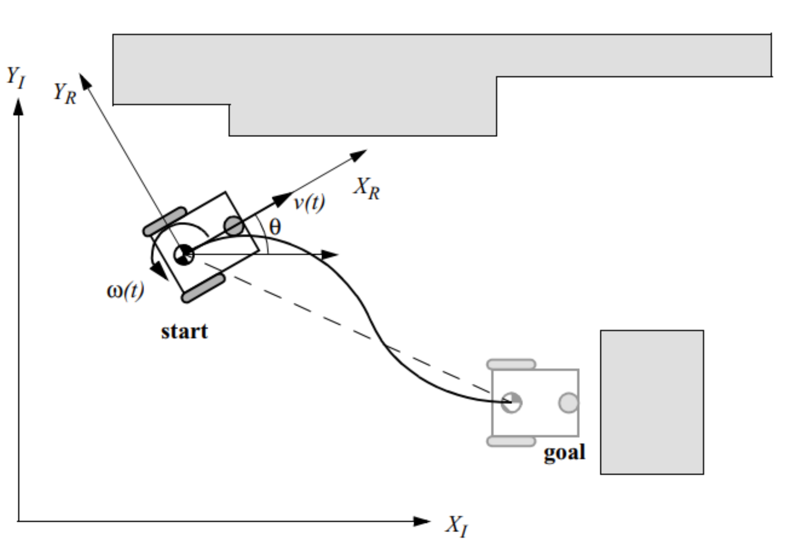

## Mobile robot localization

In **odometry** (wheel sensors only) and **dead reckoning** (also heading sensors) the position update is based on proprioceptive sensors.
The movement of the robot, sensed with wheel encoders or heading sensors or both, is integrated to compute position. Because the
sensor measurement errors are integrated, the position error accumulates over time. Thus the position has to be updated
from time to time by other localization mechanisms. Otherwise the robot is not able to maintain a meaningful position estimate in the long run. 

The algorithm we are implementing for odometry assumes we have wheel sensor readings of a differential-drive robot only.
Using additional heading sensors (i.e gyroscope) can help to reduce the cumulative errors.

There are many sources of odometric error, some of them are:
* Limited resolution during integration (time increments, measurement resolution, etc.);
* Misalignment of the wheels (deterministic);
* Uncertainty in the wheel diameter and in particular unequal wheel diameter (deterministic);
* Variation in the contact point of the wheel;
* Unequal floor contact (slipping, nonplanar surface, etc.).

Some of the errors might be *deterministic (systematic)*, thus they can be eliminated by proper calibration of the system.
However, there are still a number of *nondeterministic (random)* errors which remain, leading to uncertainties in position
estimation over time. From a geometric point of view one can classify the errors into *three* types:

1. **Range error**: integrated path length (distance) of the robot's movement -> sum of the wheel movements
2. **turn error**: similar to range error, but for turns -> difference of the wheel motions
3. **Drift error**: difference in the error of the wheels leads to an error in the robot's angular orientation

Over long periods of time, turn and drift errors far outweigh range errors, since their contribution of the overall position
error is *nonlinear*. Consider a robot whose position is initially perfectly well-known, moving forward in a straight line
along the x-acis. The error in the *y*-position introduced by a move of of *d* meters will have a component of *d sin Δθ*,
which can be quite large as the angular error *Δθ* grows. Over time, as a mobile robot moves about the environment, the rotational
error between its internal reference frame and its original reference frame grows quickly. As the robot moves away from
the origin of these refrence frames, the resulting linear error in position grows quite large. It is instructive to establish
an error model for odometric accuracy and see how the errors propagate over time.

## *An error model for odometric position estimation*

Generally the pose (position) of a robot is represented by the vector: 

pose

break

break

